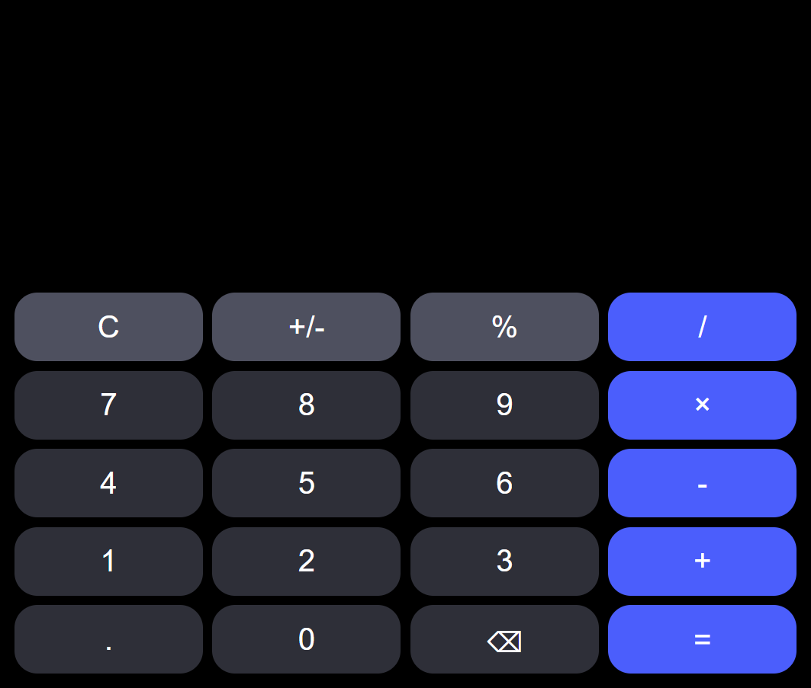

# 🧮 Web-Taschenrechner (HTML, CSS, JavaScript)

Dieses Projekt ist ein selbst entwickelter Web-Taschenrechner, den ich mit HTML, CSS und JavaScript umgesetzt habe.
Ziel war es, nicht nur eine funktionierende Anwendung zu erstellen, sondern auch sauberen Code, klare Struktur und eine benutzerfreundliche Oberfläche zu entwickeln.

# 📸 Preview

## 🌐 Der Link 

[Hier klicken, um den Taschenrechner zu testen](https://black-lock.github.io/Taschenrechner/)

# 🔹 Projektstruktur

## 🧱 HTML

Die HTML-Struktur ist bewusst klar und übersichtlich aufgebaut und besteht aus drei Hauptbereichen:

### Input-Bereich – zur Anzeige der aktuellen Eingabe

### Ausdruck-Bereich – zur Darstellung des mathematischen Ausdrucks

### Output-Bereich – zur Anzeige des berechneten Ergebnisses

Diese klare Trennung sorgt für eine gute Lesbarkeit und Wartbarkeit des Codes.

## 🎨 CSS – Individuelles Taschenrechner-Design

Das Design wurde vollständig selbst gestaltet.
Der Fokus lag auf:

- moderner Taschenrechner-Optik

- klarer Button-Struktur

- sauberer Anordnung der Elemente

- guter Benutzerfreundlichkeit

Durch gezieltes Styling wirkt der Rechner übersichtlich, strukturiert und professionell.

## ⚙️ JavaScript – Logik & Funktionalität

Die gesamte Rechenlogik wurde mit verschiedenen Funktionen umgesetzt:

✅ Funktion zur Anzeige von Zahlen bei Klick

✅ Funktion zur Verarbeitung mathematischer Operationen

✅ Funktion zur Erkennung von Operatorzeichen

✅ Schutzmechanismen gegen doppelte Operatoren

✅ Vermeidung von mehrfachen Dezimalpunkten

✅ Saubere Ausdrucksverarbeitung vor der Berechnung

Besonderen Wert habe ich darauf gelegt, fehlerhafte Eingaben zu verhindern, sodass der Ausdruck immer korrekt und logisch bleibt.

# 🎯 Lernziele & Erkenntnisse

Mit diesem Projekt konnte ich:

- DOM-Manipulation vertiefen

- Event-Handling verstehen

- String-Verarbeitung anwenden

- Logik zur Fehlervermeidung implementieren

- Strukturierte und wartbare Funktionen entwickeln

# 🚀 Motivation

Dieses Projekt zeigt mein Interesse an Webentwicklung und meine Fähigkeit, Frontend-Struktur, Design und Logik miteinander zu verbinden.
Ich lege großen Wert auf saubere Implementierung, durchdachte Funktionalität und kontinuierliche Verbesserung meiner Programmierkenntnisse.

## Viel Spaß!!
